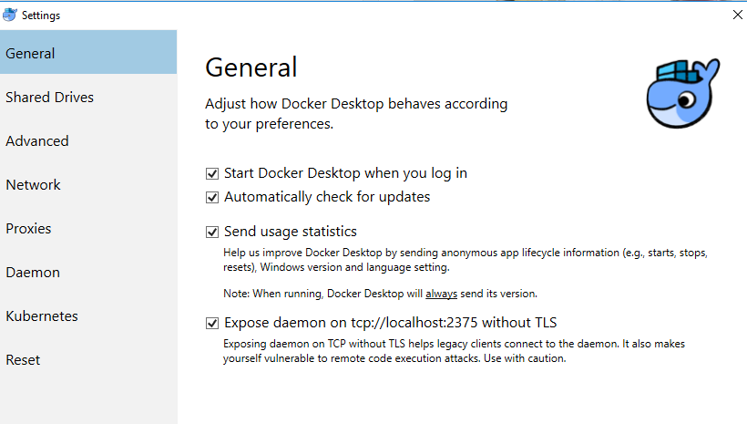

## Challenges
### Windows

* if you want to run docker from Windows it is important to enable the "Expose Daemon"    
otherwise we get the following   
error:provider.docker: Error pinging Docker server: error during connect:  
Get http://docker.for.win.localhost:2375/_ping: dial tcp: lookup docker.for.win.localhost: no such host  
